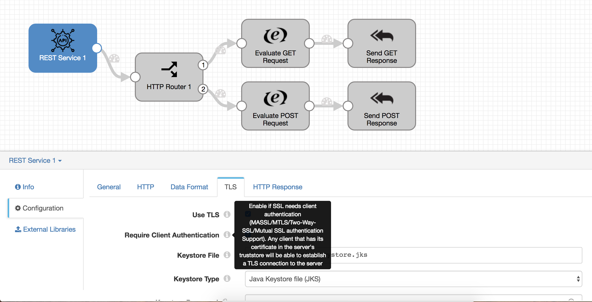
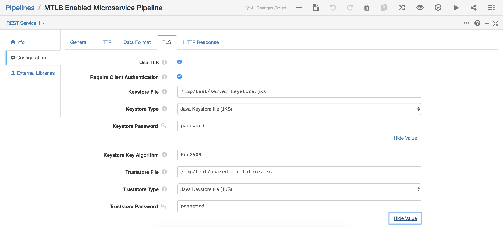
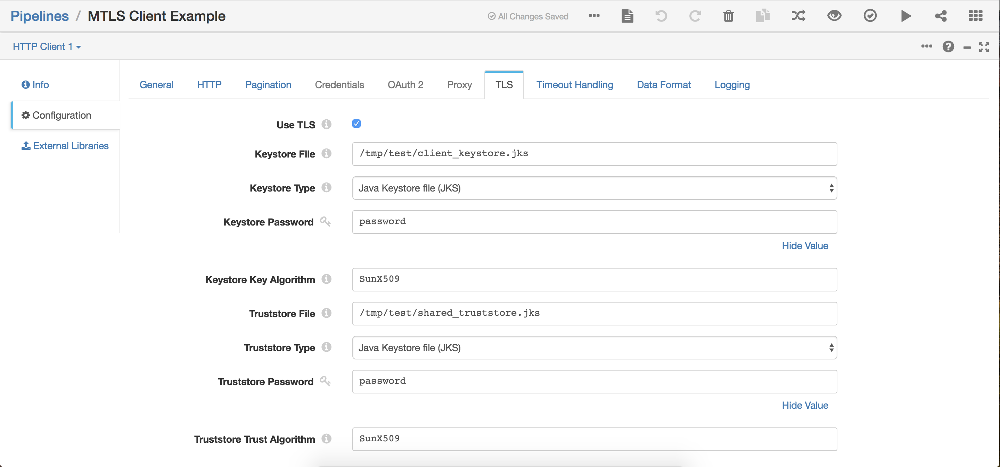

MTLS Enabled Microservice Pipeline
==============================

[Import MTLS Enabled Microservice Pipeline](http://localhost:18630?pipelineTitle=MTLS+Enabled+Microservice+Pipeline&importPipelineFromUrl=https://raw.githubusercontent.com/madhukard/streamsets-pipelines-bank/master/datacollector/microservice-mlts-enabled/MTLSEnabledMicroservicePipeline.json)

[Import MTLS Client Example Pipeline](http://localhost:18630?pipelineTitle=MTLS+Client+Example&importPipelineFromUrl=https://raw.githubusercontent.com/madhukard/streamsets-pipelines-bank/master/datacollector/microservice-mlts-enabled/MTLSClientExample.json)

Prerequisites
-------------

* [StreamSets Data Collector](https://streamsets.com/opensource/) 3.5.0 or higher

Create Truststores and Keystores for the Client and Server
-----------------------------------------------------------

# creates server keystore
    keytool -genkey \
        -noprompt \
        -trustcacerts \
        -keyalg RSA \
        -alias sdc.madhu.io \
        -dname "CN=localhost, OU=madhu.io, O=madhu.io, L=SanFrancisco, ST=California, C=US" \
        -keypass password \
        -keystore server_keystore.jks \
        -storepass password

# convert to PKCS12
    keytool -importkeystore -srckeystore server_keystore.jks -destkeystore server_keystore.jks -deststoretype pkcs12

# exports certificate from the keystore
    keytool -export -alias sdc.madhu.io -storepass password -file sdc.madhu.io.cer -keystore server_keystore.jks

# create truststore and import certificate
    keytool -import -v -trustcacerts -alias sdc.madhu.io -file sdc.madhu.io.cer -keystore shared_truststore.jks -keypass password -storepass password -noprompt

# copy the CA certs from jre/lib/security/cacerts to /etc/sdc/truststore.jks
    keytool -importkeystore -srckeystore $JAVA_HOME/jre/lib/security/cacerts -srcstorepass changeit -destkeystore shared_truststore.jks -deststorepass password

# creates client keystore
    keytool -genkey \
        -noprompt \
        -trustcacerts \
        -keyalg RSA \
        -alias client.madhu.io \
        -dname "CN=localhost, OU=madhu.io, O=madhu.io, L=SanFrancisco, ST=California, C=US" \
        -keypass password \
        -keystore client_keystore.jks \
        -storepass password

# convert to PKCS12
    keytool -importkeystore -srckeystore client_keystore.jks -destkeystore client_keystore.jks -deststoretype pkcs12

# exports certificate from the keystore
    keytool -export -alias client.madhu.io -storepass password -file client.madhu.io.cer -keystore client_keystore.jks

# create truststore and import certificate
    keytool -import -v -trustcacerts -alias client.madhu.io -file client.madhu.io.cer -keystore shared_truststore.jks -keypass password -storepass password -noprompt

Pipeline TLS Config
-------------------

