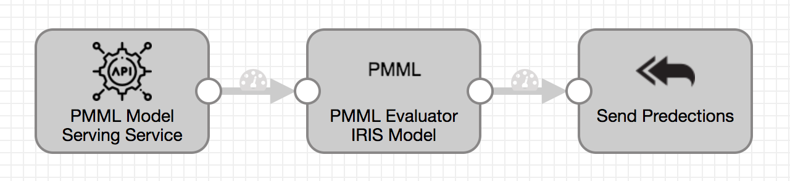

Predictive Model Markup Language (PMML) IRIS Model Serving
==============================

This pipeline implements Predictive Model Markup Language (PMML) IRIS Model Serving Microservice. 

Prerequisites
-------------

* [StreamSets Data Collector](https://streamsets.com/opensource/) 3.5.0 or higher
* StreamSets Data Collector Predictive Model Markup Language (PMML) Stage Library

Instructions
------------

* Ensure you have installed all of the prerequisite components listed above.
* [Download the pipeline](pipeline.json) and import it into Data Collector or Control Hub.
* If you see a 'Could not find stage definition' error on one or more stages, ensure you have installed the required stage libraries.
  
MORE TBD
